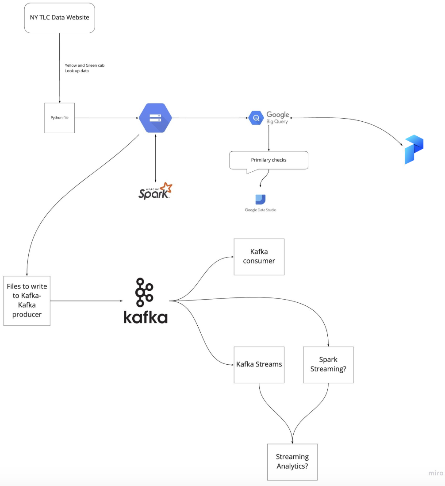

## Overview

### Architecture diagram

### Technologies
* *Google Cloud Platform (GCP)*: Cloud-based auto-scaling platform by Google
  * *Google Cloud Storage (GCS)*: Data Lake
  * *BigQuery*: Data Warehouse
* *Terraform*: Infrastructure-as-Code (IaC)
* *Docker*: Containerization
* *SQL*: Data Analysis & Exploration
* *Prefect*: Workflow Orchestration
* *dbt*: Data Transformation
* *Spark*: Distributed Processing
* *Kafka*: Streaming
